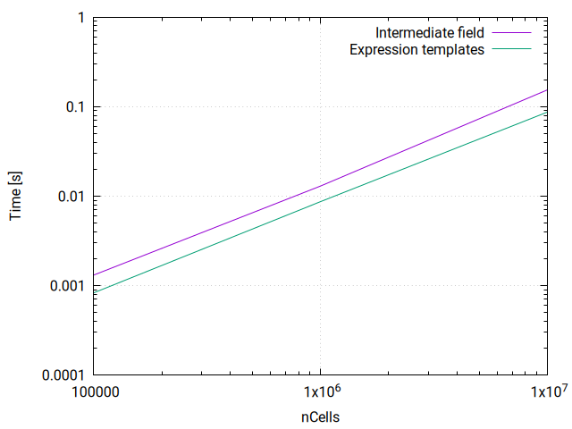

# Expression templates

- OpenFOAM is field-based syntax
- hides complex structures in formula-like syntax:
  ```
  volScalarField c(...);
  c = a + sqrt(b);
  ```
- all fields are a set of values for internal fields and
special handling of the boundary ('fvPatchFields')
- above expression does
  - allocate new temporary field (internal field + patch fields)
  - fill with sqrt(b)
  - in-place add a
  - copy values to c
- *lots* of intermediate fields
- remarkably little overhead on CPU (`kcachegrind`, few %)

---

## kcachegrind


---

## Intermediate fields
```
DebugSwitches
{
    volScalarField  1;
    surfaceTensorField  1;
}
```
- read: 5
  ```
  p, U, nut, k, epsilon
  ```
- intermediate: 80
  ```
  (1|A(U)), grad(U), surfaceIntegrate(..), linearInterpolate(..)
  ```

---

## Expression templates
- [(https://en.wikipedia.org/wiki/Expression_templates](https://en.wikipedia.org/wiki/Expression_templates) : define `operator[]` that encodes the whole operation:
  ```
  scalar add<field, sum<sqrt<field>>>::operator[i]
  {
       return a[i] + sqrt[b[i]];
  }
  ```
  and use it to evaluate:
  ```
  forAll(c, i)
  {
      c[i] = add<field, sum<sqrt<field>>>::operator[](i);
  }
  ```
---

- advantages
  - avoid intermediate storage (memory allocation)
  - avoid out-of-band access
  - easier to multi-thread
  - at evaluation time decide if boundary conditions are required
- disadvantages
  - changes truncation error
  - hard to debug
  - compilation time
  - does not allow boundary conditions on removed intermediate fields (e.g. surface fields)

---

- simple field algebra:

  - adding two fields (c = a + b)
  - Intel E5-2620 (15MB cache, 8 GB/s memory bandwidth)

  | Size     | Intermediate field| Expression templates|
  |----------|-------------------|---------------------|
  | 100000   |  0.000097         | 0.000083 |
  | 1000000  |  0.00287519       | 0.00110006 |
  | 10000000 |  0.0268587        | 0.014261 |

---

<div class="columns">
<div>

```
c = a + b
```


</div>

<div>

- more complex algebra

```
c = cos(a + 0.5*sqrt(b-sin(a)))
```



</div>
</div>

---

- constant factor (2*) so scales with size
- but memory allocation time is independent of size
- access time

---

## GeometricFields as expression templates
- already has operator[] ...
- no storage for GeometricField
- no registration
- is just expression of field operation
- and boundary conditions
- how to do I/O?

---

## (v2412) Expression template wrapper
- reference to GeometricField
- both expression templates and direct operations
    (dimensions, oriented)
- constructs expressions on this GeometricField
  - internal field : (operator on) straight list of values
  - uncoupled patch field : straight list of patch values
  - coupled patch field : blending of
    - indirect access of internal field
    - straight list of patch values

---

- wrapper syntax:
```
// Construct expression
Expression::GeometricFieldConstRefWrap<volScalarField> wa(a);
Expression::GeometricFieldConstRefWrap<volScalarField> wb(b);
const auto expression(wa + sqrt(wb));

// Evaluate expression into field c
Expression::GeometricFieldRefWrap<volScalarField> wc(c);
expression.evaluate(wc);
```

---

## 'fused' discretisation (v2412)
- exactly same purpose:
  - avoid intermediate surface fields
  - write single loop over complex expression
    ```
    const auto snGrad = [&]
    (
        const vector& Sf,

        const scalar weight,
        const scalar ownGamma,
        const scalar neiGamma,

        const scalar dc,
        const Type& ownVal,
        const Type& neiVal
    ) -> Type
    {
        const auto snGrad(dc*(neiVal-ownVal));
        const scalar faceGamma(weight*(ownGamma-neiGamma)+neiGamma);
        return mag(Sf)*faceGamma*snGrad;
    };

    fvc::surfaceSnSum
    (
        weights,
        gamma,

        deltaCoeffs,
        vf,

        snGrad,

        result,
        false       // avoid boundary evaluation until volume division
    );
    ```

---

## 'fused' discretisation (2)
- only explicit finiteVolume discretisation (Gauss laplacian, div, grad)
- changes truncation error
- has already small CPU benefit

  pitzDaily tutorial:

  | Gauss| fusedGauss|
  |------|-----------|
  | 8.22 |  7.62     |

  (identical residuals at 6 digits)

---

<!----
## Other wrappers:
- constant
- tmp
- fvMatrix (linear operations only)
- discretisation : cell-to-face linear interpolation

---

--->

## Wrapping it up
- `.expr()` to create the wrapper
- assignment to evaluate the wrapper
  ```
  c = a.expr() + sqrt(b.expr());
  ```

---

- wrapper generators

| Class| Expression | Assignment |
|------|-----------|-------------|
| List | .expr() | 	yes |
| Field | 	.expr() | 	yes |
| GeometricField (e.g. volScalarField) | 	.expr() | 	yes |
| tmp\<Field\> | 	.expr() | 	no |
| tmp\<GeometricField\> |	.expr() | 	no |
| DimensionedType (for constant Field) | 	.expr(\<size\>) | 	no |
| DimensonedType (for constant GeometricField) | 	.expr(\<GeoField\>) | 	no |
| fvMatrix | 	.expr() | 	yes |

---

## Detail : constants

- when used in `Field` expression : only size (and value) required:
  ```
  const Expression::UniformListWrap<scalar> two(mesh.nCells(), 2.0);
  ```
  or
  ```
  const auto two(dimensionedScalar(dimless, 2.0).expr(mesh.nCells()));
  ```
- when used in `GeometricField` expression : needs GeometricField reference:
  ```
  const auto two(dimensionedScalar(dimless, 2.0).expr(mesh.magSf()));
  ```
  (GeometricField needs to be 'live' at evaluation time)

---

## Discretisation

| Function | 	Input   | Output |
|----------|----------|--------|
| linear interpolation	| expression template | expression template |
| uncorrected Gauss Laplacian	| fvMatrix, expression template | fvMatrix |

---

## Detail : Gauss Laplacian

```
// Get expression for difference weights
const auto deltaCoeffs = this->tsnGradScheme_().deltaCoeffs(vf).expr();

// Get expression for interpolation weights
const auto weights = this->tinterpGammaScheme_().weights(gamma).expr();

// Interpolate gamma field and multiply with face-area magnitude
const auto gammaMagSf =
    Expression::lerp(gamma.expr(), weights, mesh)
  * mesh.magSf().expr();

// Create upper
fvm.upper() = deltaCoeffs.internalField()*gammaMagSf.internalField()
```

---

## More timings
- volField operations
  - no threads
  - compile with threads

---

## Typical application: kOmegaSST F1 function
```
auto arg1 = min
(
    min
    (
        max
        (
            (one/betaStar)*sqrt(k_.expr())/(omega_.expr()*y_.expr()),
            fiveHundred
           *(this→mu().expr()/this→rho_.expr())
           /(sqr(y_.expr())*omega_.expr())
        ),
        fourAlphaOmega2*k_.expr()/(CDkOmegaPlus*sqr(y_.expr()))
    ),
    ten
);
return tanh(pow4(arg1));
```

---

## Caveats

- coupled boundary condition always uses indirect list into internal
- no conditionals / in-place operations
  - original code:
    ```
    tmp<volScalarField> f23(F2());

    if (F3_)
    {
        f23.ref() *= F3();
    }
    ```
  - move condition to non-templated code or
  - always evaluate F3 but with scalar

---

## Adapt for offloading
- bottom level evaluation is
  ```
  for (label i = 0; i < lst.size(); ++i)
  {
      lst[i] = operator[](i);
  }
- replace with
  ```
  std::copy
  (
      std::execution::par_unseq,
      static_cast<E const&>(*this).cbegin(),
      static_cast<E const&>(*this).cend(),
      lst.begin()
  );
  ```
- requires random-access iterators

---

## Future work
- 90% solution
  - extend to all operators, functions
  - have 'expr()' for UIndirectList
  - fix fvMatrix source terms
  - handle type-changing code (scalar*vector)
- have _expr functions for finiteVolume discretisation?
- test with GPU
- apply!

---

Complex expression templates timings

  | Size     | Intermediate field| Expression templates|
  |----------|-------------------|---------------------|
  | 100000   |  0.0013081        | 0.00082692 |
  | 1000000  | 0.012962          | 0.00867148 |
  | 10000000 | 0.154202          | 0.087044 |

---

```
Test-expressionTemplates-volFields.o:Test-expressionTemplates-volFields.C:funct
ion void tbb::detail::d1::dynamic_grainsize_mode<tbb::detail::d1::adaptive_mode
<tbb::detail::d1::auto_partition_type> >::work_balance<tbb::detail::d1::start_f
or<tbb::detail::d1::blocked_range<Foam::Expression::List_add<Foam::Expression::
ListConstRefWrap<double>, Foam::Expression::ListConstRefWrap<double> >::const_i
terator>, __pstl::__tbb_backend::__parallel_for_body<Foam::Expression::List_add
<Foam::Expression::ListConstRefWrap<double>, Foam::Expression::ListConstRefWrap
<double> >::const_iterator, __pstl::__internal::__pattern_walk2_brick<__pstl::e
xecution::v1::parallel_unsequenced_policy const&, Foam::Expression::List_add<Fo
am::Expression::ListConstRefWrap<double>, Foam::Expression::ListConstRefWrap<do
uble> >::const_iterator, double*, std::copy<__pstl::execution::v1::parallel_uns
equenced_policy const&, Foam::Expression::List_add<Foam::Expression::ListConstR
efWrap<double>, Foam::Expression::ListConstRefWrap<double> >::const_iterator, d
ouble*>(__pstl::execution::v1::parallel_unsequenced_policy const&, Foam::Expres
sion::List_add<Foam::Expression::ListConstRefWrap<double>, Foam::Expression::Li
stConstRefWrap<double> >::const_iterator, Foam::Expression::List_add<Foam::Expr
ession::ListConstRefWrap<double>, Foam::Expression::ListConstRefWrap<double> >:
:const_iterator, double*)::{lambda(Foam::Expression::List_add<Foam::Expression:
:ListConstRefWrap<double>, Foam::Expression::ListConstRefWrap<double> >::const_
iterator, Foam::Expression::List_add<Foam::Expression::ListConstRefWrap<double>
, Foam::Expression::ListConstRefWrap<double> >::const_iterator, double*)#1}>(__
pstl::execution::v1::parallel_unsequenced_policy const&, Foam::Expression::List
_add<Foam::Expression::ListConstRefWrap<double>, Foam::Expression::ListConstRef
Wrap<double> >::const_iterator, Foam::Expression::List_add<Foam::Expression::Li
stConstRefWrap<double>, Foam::Expression::ListConstRefWrap<double> >::const_ite
rator, double*, std::copy<__pstl::execution::v1::parallel_unsequenced_policy co
nst&, Foam::Expression::List_add<Foam::Expression::ListConstRefWrap<double>, Fo
am::Expression::ListConstRefWrap<double> >::const_iterator, double*>(__pstl::ex
ecution::v1::parallel_unsequenced_policy const&, Foam::Expression::List_add<Foa
m::Expression::ListConstRefWrap<double>, Foam::Expression::ListConstRefWrap<
> >::const_iterator, Foam::Expression::List_add<Foam::Expression::ListConstRefW
rap<double>, Foam::Expression::ListConstRefWrap<double> >::const_iterator, doub
le*)::{lambda(Foam::Expression::List_add<Foam::Expression::ListConstRefWrap<dou
ble>, Foam::Expression::ListConstRefWrap<double> >::const_iterator, Foam::Expre
ssion::List_add<Foam::Expression::ListConstRefWrap<double>, Foam::Expression::L
istConstRefWrap<double> >::const_iterator, double*)#1}, std::integral_constant<
bool, true>)::{lambda()#1}::operator()() const::{lambda(Foam::Expression::List_
add<Foam::Expression::ListConstRefWrap<double>, Foam::Expression::ListConstRefW
rap<double> >::const_iterator, Foam::Expression::List_add<Foam::Expression::Lis
tConstRefWrap<double>, Foam::Expression::ListConstRefWrap<double> >::const_iter
ator)#1}>, tbb::detail::d1::auto_partitioner const>, tbb::detail::d1::blocked_r
ange<Foam::Expression::List_add<Foam::Expression::ListConstRefWrap<double>, Foa
m::Expression::ListConstRefWrap<double> >::const_iterator> >(__pstl::execution
v1::parallel_unsequenced_policy const&, tbb::detail::d1::blocked_range<Foam::Ex
pression::List_add<Foam::Expression::ListConstRefWrap<double>, Foam::Expression
::ListConstRefWrap<double> >::const_iterator>&, tbb::detail::d1::execution_data
&): error: undefined reference to 'tbb::detail::r1::allocate(tbb::detail::d1::s
mall_object_pool*&, unsigned long, tbb::detail::d1::execution_data const&)
```
---

# OpenCFD (Keysight)

A unique opportunity to join our well established core development team, to contribute to the OpenFOAM 6-monthly release cycles, close interaction with international Customers and on-site support engineers.

## Requirements

Minimum 3 years experience in core OpenFOAM Development
Intermediate to advanced knowledge of C++
Applicants must be eligible to work in the UK

## Desirable

Solver experience; segregated and coupled solver
Physics Modelling experience in Heat Transfer, Combustion, Radiation
Scripting e.g. bash, ruby, python
Understanding of meshing concepts, computer architectures, HPC and parallelism
GPU

## Location

Bracknell, UK


## Remuneration

Competitive UK-based salary relative to experience
Standard bank holidays + 25 days vacation
Benefits include company pension contribution, private health care and in-service life insurance
